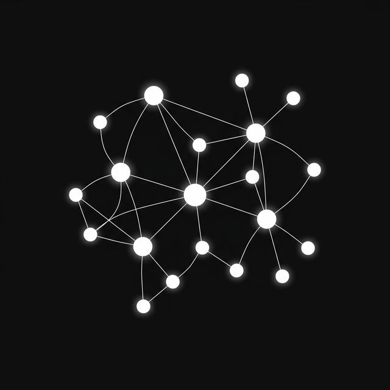

# Swarm Intelligence Prediction Engine

Multi-agent AI debate engine for prediction.

**Demo:** [veda.ng/swarm-prediction](https://veda.ng/swarm-prediction)



---

## What This Is

If you ask one LLM to predict something, you get one answer with one set of biases. Ask again, same answer, different words. Nothing pushes back.

This takes a different approach. Feed it data and a question. It spins up 10–100 agents with different expertise, reasoning styles, and risk tolerances. They argue across multiple rounds and change their minds when they hear better arguments. A separate agent reads the full debate and writes the final report.

You can read every argument, see who flipped and why, and ask follow-up questions.

---

## Architecture

```text
┌──────────────────────────────────────────────────────┐
│  FRONTEND  (Vue 3 + Vite + D3.js)                    │
│                                                      │
│  Views: Home, Project Results, Wiki                  │
│  Components: SwarmGraph (D3 force-directed)          │
│  HTTP client (api/)                                  │
└──────────────────────┼───────────────────────────────┘
                       │ JSON over HTTP

┌──────────────────────┼───────────────────────────────┐
│  BACKEND  (Python + Flask, :5001, threaded)          │
│                                                      │
│  ┌────────────────────┴───────────────────────────┐  │
│  │  api/       Route handlers                     │  │
│  └────────────────────┬───────────────────────────┘  │
│                      │                               │
│  ┌────────────────────┴───────────────────────────┐  │
│  │  services/                                     │  │
│  │                                                │  │
│  │  OntologyGenerator → GraphBuilder              │  │
│  │      → AgentGenerator → SimulationEngine       │  │
│  │           → ReportAgent                        │  │
│  └────────────────────────────────────────────────┘  │
│                                                      │
│  models/    KnowledgeGraph (in-memory graph)         │
│  utils/     LLM client (OpenAI + Anthropic, retry)   │
│             Logger (structured, file rotation)        │
└──────────────────────────────────────────────────────┘
```

---

## Pipeline

Five stages, each feeds the next:

### 1. Ingest

- Accepts PDF, Markdown, plain text
- PDFs parsed with PyMuPDF, everything else read directly
- Full text kept, no summarisation
- Truncated at ~12k chars to fit context windows

### 2. Ontology

- LLM looks at the text and identifies what *types* of things are in it
- Produces 4–6 entity types (people, companies, regulators, etc.)
- Produces 3–5 relationship types (acquired, regulates, competes with, etc.)
- This is a schema, not data — no entities extracted yet
- Person and Organization always included as fallbacks

### 3. Knowledge Graph

- `GraphBuilder` sends the schema + text to the LLM in one call
- Extracts concrete entities (names, types, one-line summaries)
- Extracts relationships (directional, typed: "A → ACQUIRED → B")
- Populates an in-memory `KnowledgeGraph` with adjacency tracking
- If zero entities found: retries with simpler prompt, then falls back to four default archetypes

**Two jobs:** gives agents shared facts to argue from, and decides what kinds of agents to create.

### 4. Agents

`AgentGenerator` creates profiles. Each agent gets:

| Property | Example values |
| --- | --- |
| Entity type | Person, Organization, Analyst |
| Bio | "Former regulator turned energy consultant" |
| Personality | analytical, contrarian, pragmatic, skeptical |
| Stance | supportive, opposing, neutral, cautious |
| Activity level | 0.0–1.0 |
| Influence | 0.0–1.0 |

First batch comes from graph entities. If that's fewer than the target count, a second LLM call fills in more archetypes (journalists, academics, lobbyists, etc.). Duplicates filtered by name.

### 5. Simulation

Runs in a daemon thread. Per round:

1. **Select agents** — scored by: connection to recent posters (+0.5), haven't posted yet (+0.3), random noise (+0.0–0.3). Top N picked.
2. **Each agent posts** — gets a system prompt with its persona, last ~3k chars of the feed, its own last 5 posts, and its connections. Returns JSON: `{post, reply_to, current_stance, stance_reason}`.
3. **Track shifts** — if stance changed, log: who, what round, old → new, why.
4. **Update feed** — posts appended as `[R3] AgentName: content`.

After all rounds, agents grouped by final stance into clusters.

### 6. Report

- A separate `ReportAgent` (not part of the debate) reads the full transcript
- Writes a Markdown report: executive summary, key findings, agreements, disagreements, risk factors, final prediction
- After the report, you can ask follow-up questions via chat (last 10 messages of context kept)

---

## Depth Presets

| Preset | Agents | Rounds | Per Round | Time | LLM Calls |
| --- | --- | --- | --- | --- | --- |
| Quick | 10 | 4 | 4 | ~1 min | ~25 |
| Balanced | 30 | 8 | 6 | ~3 min | ~60 |
| Deep | 50 | 12 | 8 | ~8 min | ~110 |
| Maximum | 100 | 16 | 10 | ~15 min | ~180 |

Call count = ontology (1) + graph (1) + agents (1–2) + simulation (per_round × rounds) + report (1). Simulation dominates.

---

## LLM Integration

The `LLM` class in `utils/llm_client.py`:

- **Anthropic** — detected by `sk-ant-` prefix or `LLM_PROVIDER=anthropic`. Uses the `anthropic` SDK. Separates system messages, enforces user/assistant alternation.
- **OpenAI-compatible** — everything else. Uses the `openai` SDK with configurable `base_url`. Covers OpenAI, Gemini, Groq, Mistral, Together, OpenRouter, DeepSeek.

Both paths:
- Retry with exponential backoff (up to 5 attempts)
- Rate limit detection (429, "rate" in error, "overloaded")
- `<think>` tag stripping for CoT models
- `complete_json()` — strips markdown fences, finds JSON objects/arrays in messy output, falls back to `{}`

---

## Tech Stack

| Layer | Tech |
| --- | --- |
| Frontend | Vue 3, Vite |
| Backend | Python 3, Flask (threaded) |
| Graph vis | D3.js force-directed |
| PDF parsing | PyMuPDF |
| Config | python-dotenv |
| CORS | flask-cors |

---

## Project Structure

```text
backend/
├── run.py                          # starts Flask on :5001
├── app/
│   ├── config.py                   # Settings from .env
│   ├── api/                        # route handlers
│   ├── models/
│   │   └── knowledge_graph.py      # entities, relationships, adjacency
│   ├── services/
│   │   ├── ontology_generator.py   # infer entity/relation types
│   │   ├── graph_builder.py        # extract entities, build graph
│   │   ├── agent_generator.py      # create agent profiles
│   │   ├── simulation_engine.py    # multi-round debate
│   │   └── report_agent.py         # write report + Q&A chat
│   └── utils/
│       ├── llm_client.py           # OpenAI + Anthropic, retry, JSON parsing
│       └── logger.py               # structured logging

frontend/
├── src/
│   ├── views/                      # Home, Project, Wiki
│   ├── components/                 # SwarmGraph (D3)
│   ├── api/                        # HTTP client
│   ├── router/                     # Vue Router
│   └── assets/                     # CSS, images
```

---

## Running Locally

```bash
git clone https://github.com/vedangvatsa123/vedang-swarm-prediction.git
cd vedang-swarm-prediction

# Backend
cp .env.example .env
# edit .env → set LLM_API_KEY, optionally LLM_PROVIDER and LLM_MODEL_NAME

cd backend
pip install -r requirements.txt
python run.py                # :5001

# Frontend (new terminal)
cd frontend
npm install
npm run dev                  # :3000
```

Open [localhost:3000](http://localhost:3000).

---

## Environment Variables

| Variable | Default | What it does |
| --- | --- | --- |
| `LLM_API_KEY` | — | Your API key. Required. |
| `LLM_PROVIDER` | `openai` | `openai` or `anthropic` |
| `LLM_BASE_URL` | `https://api.openai.com/v1` | Change for other providers |
| `LLM_MODEL_NAME` | `gpt-4o-mini` | Model for all LLM calls |
| `FLASK_PORT` | `5001` | Backend port |
| `FLASK_DEBUG` | `True` | Debug mode |

---

## Security

- **API keys** — stored in browser local storage, sent over HTTPS, used once per call, then dropped. Never logged, never written to disk.
- **Input data** — lives in memory during the run. Nothing persists after. No database, no accounts, no tracking.
- **Upload limit** — 50 MB.

---

## Limitations

- **Bad input = bad output.** Give it specific data and a clear question.
- **LLM limits apply.** Agents inherit the model's training cutoff and reasoning quirks.
- **Not calibrated.** No real-outcome feedback loop. Confidence numbers are relative, not probabilities.
- **Cost scales with depth.** Maximum = ~180 LLM calls. Start with Quick.
- **Context truncation.** 12k chars for graph extraction, 3k chars for the simulation feed. Long docs lose the tail.
